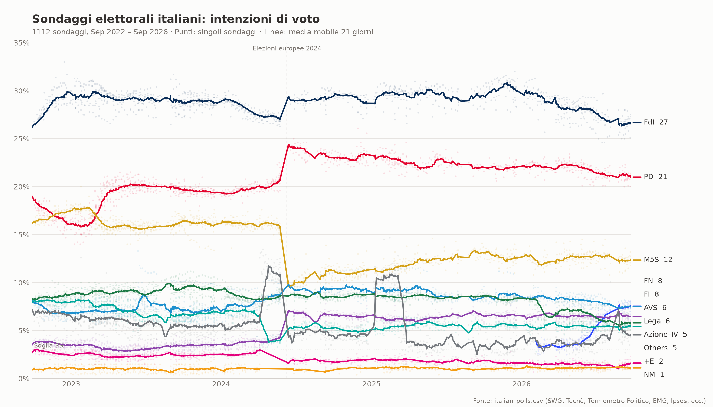
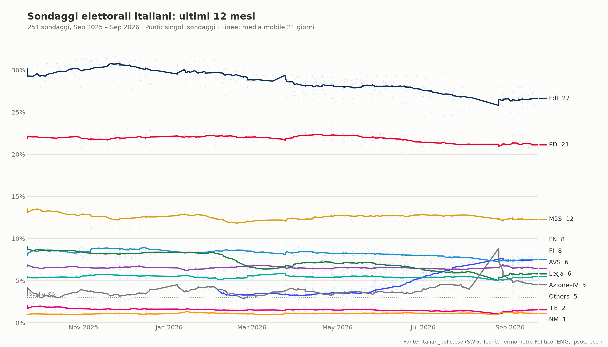
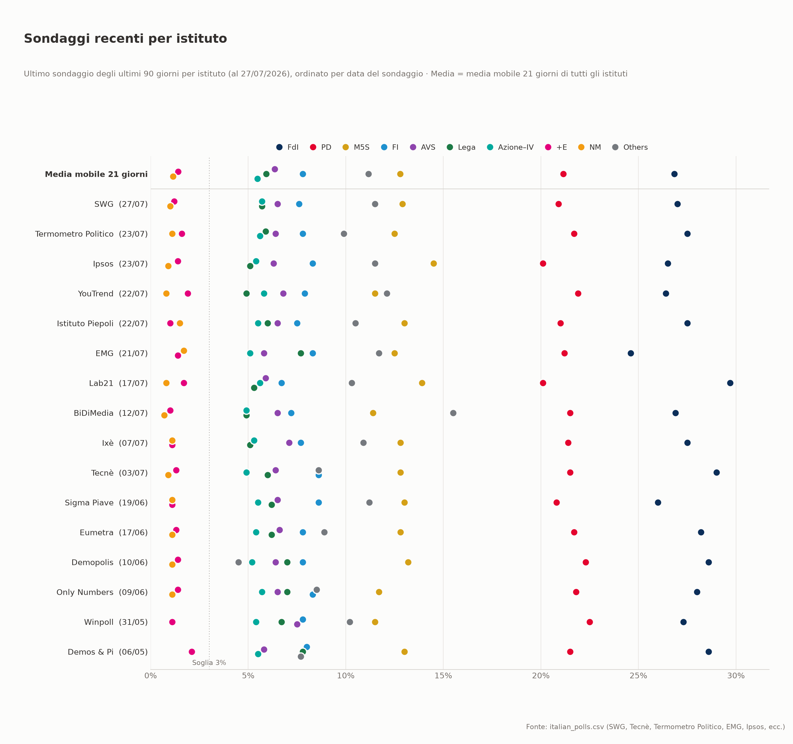

# ItalPolls — Italian General Election Polling Visualization

Visualizes Italian general-election ("Sondaggi elettorali") polling data as a
PNG chart: every individual poll as a faint dot, with a 21-day rolling-average
trend line per party, from September 2022 (the last general election) through
July 2026.



A second chart zooms in on just the last 12 months:



A third chart compares institutes ("house effects"): each row is an
institute's most recent poll from the past 90 days, sorted by poll date, with
the all-institute rolling average on top for reference:



## Usage

Requires [uv](https://docs.astral.sh/uv/) and Python ≥ 3.14. Dependencies
(pandas, matplotlib) are managed in `pyproject.toml`.

```sh
uv run main.py
```

This writes all three PNGs. Options:

```sh
uv run main.py --csv path/to/polls.csv --out chart.png --out-recent recent.png --out-institutes institutes.png
```

## Data

`italian_polls.csv` contains 1,058 polls with one row per poll, scraped from
[Wikipedia's "Opinion polling for the next Italian general election"](https://en.wikipedia.org/wiki/Opinion_polling_for_the_next_Italian_general_election):

| Column | Description |
|---|---|
| `date` | Fieldwork end date |
| `institute` | Polling institute (SWG, Tecnè, Termometro Politico, EMG, Ipsos, …) |
| `survey_start` / `survey_end` | Fieldwork period |
| `sample_size` | Respondents (where reported) |
| `FdI`, `PD`, `M5S`, `Lega`, `FI`, `AVS`, `+E`, `NM` | Party vote shares in percent |
| `Az-IV` | Azione + Italia Viva combined (reported jointly for parts of the period, so tracked as one series) |
| `Others` | All remaining minor lists (Italexit, DSP, PLD, UP, SUE, …), which vary a lot over time as pollsters add or drop niche lists from their questionnaires — expect this series to be noisy |

Wikipedia's source tables occasionally report a single combined value for two
adjacent minor-party columns via a spanning cell (e.g. a joint Azione/Italia
Viva figure). The scrape parses the raw HTML `colspan` rather than
`pandas.read_html`'s column output, since the latter duplicates a spanned
cell's value into each column and would double-count it when summed.

## Chart design

- **Dots** are individual polls (semi-transparent); **lines** are 21-day
  rolling averages, so sparse series plot correctly.
- A dashed vertical line marks the June 2024 European Parliament election
  (the September 2022 general election falls right at the left edge of the
  data and isn't separately marked); a dotted line marks Italy's 3% national
  electoral threshold.
- Colors follow each party's conventional brand color, adjusted for contrast
  and colorblind separation. Every line is directly labeled with its latest
  average, so no series is identified by color alone.
